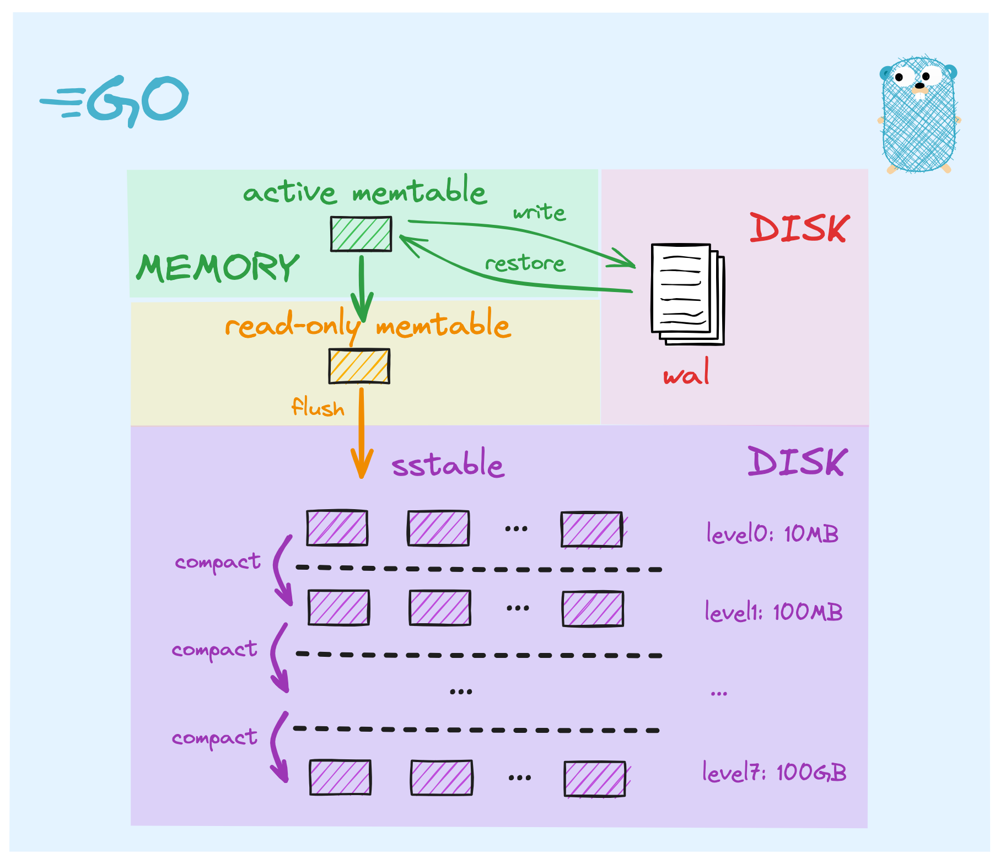

# SwiftDB: An LSM Tree based Key-Value Storage Engine in Go

## Introduction

SwiftDB is an LSM tree based storage engine written in Go. It offers a simple key-value interface and is designed to be used as an embedded storage engine. It is designed to offer high-write throughput with reasonable read performance.

## Features

1. Simple key-value interface: `Put(key, value)`, `Get(key)`, `Delete(key)`, `RangeScan(startKey, endKey)`.
1. Multi-component LSM tree: Includes a high-throughput in-memory component and multiple disk-based components for persistence.
1. Read-optimized: Uses a Bloom filters and on-disk indexes to speed up reads.
1. Automatic compaction: Automatically compacts disk-based components using a tiered compaction strategy to control read and write amplification.

## Usage

### Opening a DB instance

First, you need to open an storage engine instance. You can do this using the `Open` function from the swiftdb package. This function takes three arguments: the directory where the LSM tree will be stored, the maximum size of the in-memory component before it is flushed, and a boolean indicating whether to enable the write-ahead log (WAL).

```go
dir := "db_directory"
// Open a new LSM tree instance with a 64MB in-memory component, and enable crash recovery.
db, err := SwiftDB.Open(dir, 64_000_000, true)
```

### Writing to the DB

You can write key-value pairs to the DB using the Put method. The key should be a string and value can be any byte slice.

```go
err := db.Put("key", []byte("value"))
```

Updating a key is the same as writing to it.

### Reading from the DB

#### Get

You can read a value from the DB using the Get method. This method takes a key and returns the corresponding value.

```go
value, err := db.Get("key")
```

#### RangeScan

You can perform a range scan on the DB using the RangeScan method. This method takes two keys and returns all key-value pairs where the key is within the range of the two keys.

```go
// Get all key-value pairs where the key is between "key1" and "key5".
pairs, err := db.RangeScan("key1", "key5")

if err != nil {
    // Handle error.
}

for _, pair := range pairs {
    fmt.Println(pair.Key, pair.Value)
}
```

### Deleting from the DB

You can delete a key-value pair from the DBD using the `Delete`` method. This method takes a key and removes the corresponding key-value pair from the tree.

```go
err := db.Delete("key")
```

### Closing the DB

Finally, you should close the DB when you're done using it. You can do this using the Close method. Closing the DB will flush the in-memory component to disk, close the write-ahead log, and run any scheduled compactions.

```go
err := db.Close()
```
